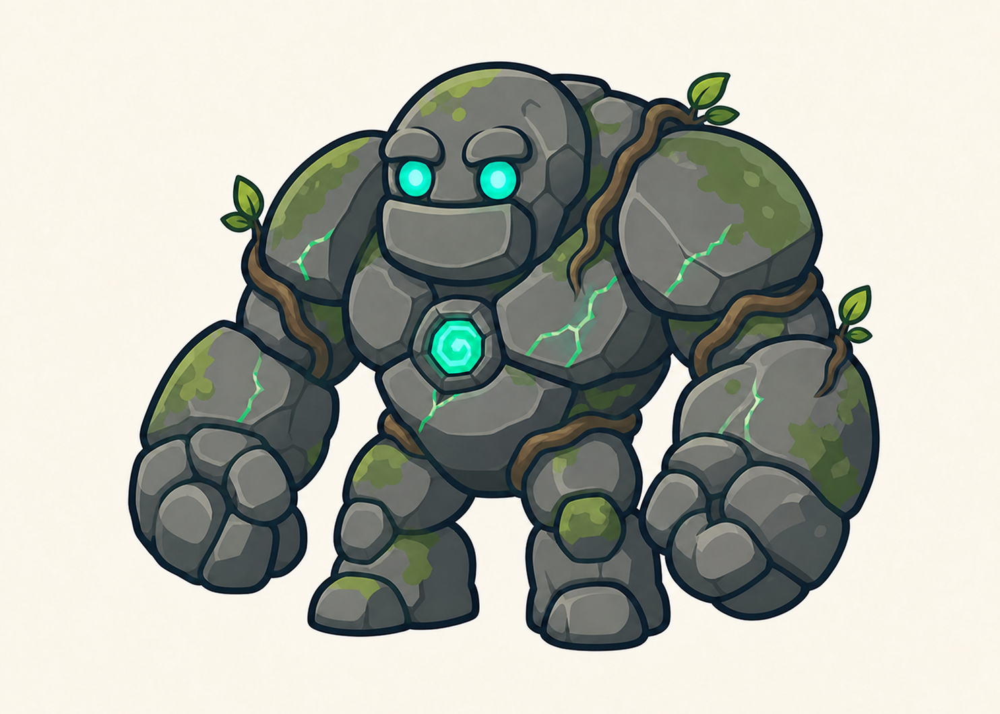

# Golem de la Forêt

> **Statut :** Validé

## Rôle

Le Golem de la Forêt est le premier gardien affronté par Imran. Il introduit les règles générales des combats de boss : observer, se défendre et profiter d'une ouverture pour contre-attaquer.

## Apparence

Le golem possède un corps court, massif et robuste. Il est principalement constitué de grandes pierres grises aux formes arrondies.

Son apparence forestière repose sur :

- des plaques de pierre couvertes par endroits de mousse ;
- de fines racines entourant certaines parties de son corps ;
- quelques petites feuilles et pousses végétales ;
- des fissures parcourues par une énergie verte ;
- deux grands yeux ronds et lumineux ;
- un cœur magique vert placé au centre de son torse.

Sa silhouette est imposante, mais son visage reste suffisamment expressif et peu effrayant pour un public à partir de 7 ans.

Le Golem de la Forêt mesure environ deux fois et demie la taille d'Imran. Cette différence le rend impressionnant tout en conservant une silhouette entièrement lisible à l'écran.

## Personnalité

Le golem est un gardien silencieux et obéissant. Il n'est pas naturellement méchant, mais il est contrôlé par la magie de Tata Lisa et accomplit sa mission sans remettre ses ordres en question.

Son attitude doit transmettre la puissance et la détermination plutôt que la cruauté.

## Apparition

Avant le combat, le Golem de la Forêt reste immobile devant le coffre et ressemble à une ancienne statue couverte de mousse.

Lorsqu'Imran s'approche, les racines qui entourent son corps commencent à bouger. Ses yeux et son cœur magique s'illuminent, puis il se redresse pour barrer l'accès au coffre.

## Intention du combat

Le Golem de la Forêt se déplace lentement et utilise des actions puissantes clairement annoncées. Le combat doit permettre au joueur d'apprendre à utiliser le saut, la Shadow Sword et le Bouclier de lumière.

Aucun pouvoir débloqué plus tard dans l'aventure n'est nécessaire pour le vaincre.

## Récompense

Après sa victoire, Imran peut ouvrir le coffre protégé par le golem et récupérer la première clé. Ses trois cœurs et ses trois vies sont ensuite restaurés.

## Défaite

Lorsque le golem est vaincu les fissures lumineuses de son corps perdent progressivement leur éclat et son cœur magique s'éteint.

Son corps se désassemble doucement en pierres, en racines et en feuilles, sans représentation violente. Le coffre qu'il protégeait devient alors accessible.

## Référence visuelle

## À détailler dans le GDD

- Phases du combat.
- Attaques.
- Fenêtres de vulnérabilité.
- Mise en scène.
