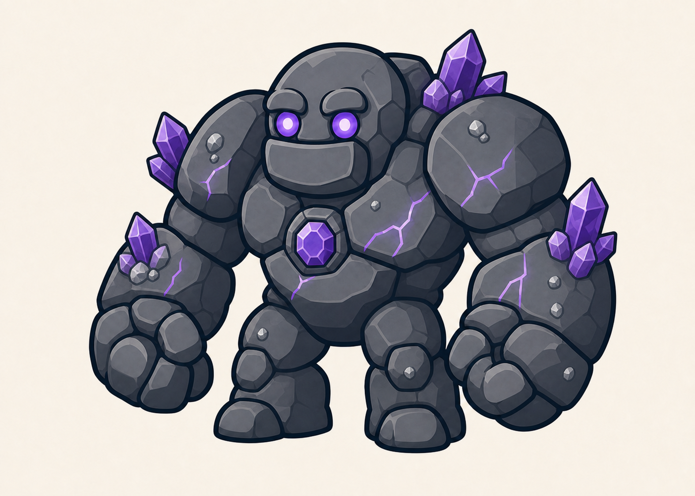

# Golem de la Grotte

> **Statut :** Validé

## Rôle

Le Golem de la Grotte est le deuxième gardien affronté par Imran. Il vérifie que le joueur maîtrise les principes appris contre le premier golem avant de lui donner accès à une nouvelle capacité.

## Apparence

Le golem conserve la silhouette commune aux six gardiens : un corps court et massif, de très grands poings arrondis, des jambes courtes et deux grands yeux ronds.

Son apparence minérale repose sur :

- de grandes pierres gris foncé aux formes arrondies ;
- des cristaux d'améthyste violets sur les épaules, les avant-bras et le dos ;
- de petits fragments de minerais argentés incrustés dans son corps ;
- des fissures parcourues par une énergie violette ;
- deux yeux ronds émettant une lumière violette ;
- un cœur magique en forme de cristal d'améthyste placé au centre de son torse.

Le Golem de la Grotte mesure environ deux fois et demie la taille d'Imran. Il reste imposant, expressif et adapté aux enfants à partir de 7 ans.

## Personnalité

Le golem est un gardien silencieux et obéissant. Il n'est pas naturellement méchant, mais il est contrôlé par la magie de Tata Lisa et protège le coffre sans hésitation.

Son attitude transmet une impression de solidité et de patience.

## Apparition

Avant le combat, le Golem de la Grotte est intégré à une paroi rocheuse couverte de cristaux et paraît faire partie du décor.

Lorsque Imran approche du coffre, les cristaux commencent à vibrer et une lumière violette traverse progressivement les fissures de la paroi. Les yeux et le cœur magique du gardien s'allument, puis il se détache lentement de la roche pour barrer le passage.

Cette apparition reprend la même direction que celle du Golem de la Forêt : le gardien est d'abord confondu avec son environnement avant de s'éveiller.

## Intention du combat

Le combat doit vérifier que le joueur maîtrise :

- l'observation des actions du boss ;
- le saut ;
- la Shadow Sword et le Smash Tranchant ;
- le Bouclier de lumière ;
- les contre-attaques au bon moment.

Le Dash n'est pas nécessaire pour vaincre ce golem, puisqu'il est débloqué après le combat.

## Récompense

Après sa victoire, Imran peut ouvrir le coffre et récupérer la deuxième clé. Il débloque également le Dash.

Ses trois cœurs et ses trois vies sont ensuite restaurés avant le niveau suivant.

## Défaite

Lorsque le golem est vaincu, la lumière de ses fissures et de ses cristaux diminue progressivement. Son cœur magique s'éteint, puis son corps se désassemble doucement en roches, minerais et fragments de cristaux, sans représentation violente.

Le coffre qu'il protégeait devient alors accessible.

## Référence visuelle

## À détailler dans le GDD

- Phases du combat.
- Attaques.
- Fenêtres de vulnérabilité.
- Mise en scène précise.
