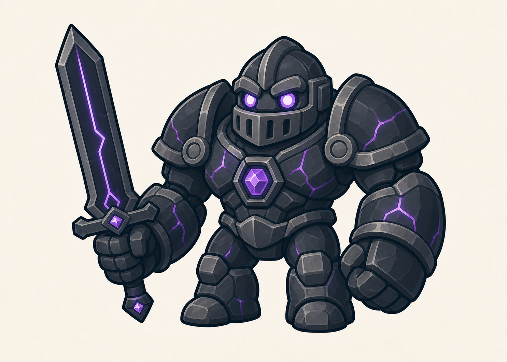

# Golem du Château

> **Statut :** Validé

## Rôle

Le Golem du Château est le sixième et dernier gardien créé par Tata Lisa. Il protège le coffre contenant la dernière clé nécessaire pour ouvrir les six verrous du donjon.

Ce combat constitue l'épreuve finale avant l'affrontement contre Tata Lisa.

## Apparence

Le golem conserve la silhouette commune aux six gardiens : un corps court et massif, de grands poings, des jambes courtes et deux grands yeux ronds.

Son apparence de chevalier repose sur :

- un corps constitué de pierre gris anthracite et d'obsidienne ;
- une armure de chevalier sombre, massive et symétrique ;
- de larges épaulières renforcées ;
- un casque intégré à sa tête avec une visière relevée ;
- deux yeux ronds émettant une lumière violette ;
- des fissures parcourues par une énergie violette ;
- un cœur magique en forme de cristal violet placé au centre du torse ;
- une grande épée composée de métal sombre et d'obsidienne ;
- une ligne d'énergie violette parcourant la lame.

Le Golem du Château mesure environ deux fois et demie la taille d'Imran. Son armure et son épée le rendent plus impressionnant que les gardiens précédents, tout en conservant un style cartoon adapté aux enfants à partir de 7 ans.

## Personnalité

Le golem est un chevalier silencieux, discipliné et entièrement loyal à Tata Lisa. Contrairement aux autres gardiens, il donne l'impression de combattre avec méthode et maîtrise.

Son attitude doit transmettre la puissance, la vigilance et le sens du devoir plutôt que la cruauté.

## Apparition

Avant le combat, le Golem du Château ressemble à une grande statue de chevalier placée devant le coffre. Il reste immobile, son épée plantée dans le sol et ses lumières magiques éteintes.

Lorsque Imran approche, les gravures de l'épée commencent à émettre une lumière violette. Son cœur et ses yeux s'allument, puis le gardien retire lentement sa lame du sol et descend de son socle pour barrer le passage.

Cette apparition conserve la direction commune aux golems : le gardien est d'abord confondu avec un élément de son environnement avant de s'éveiller.

## Intention du combat

Le combat doit vérifier la maîtrise de toutes les capacités acquises par Imran :

- l'observation des actions du boss ;
- la Shadow Sword et le Smash Tranchant ;
- le Bouclier de lumière ;
- le Dash ;
- le Double saut ;
- l'enchaînement des déplacements, de la défense et des contre-attaques.

La présence de l'épée donne au combat une identité différente des affrontements précédents. Ses actions doivent toutefois rester clairement annoncées et compréhensibles.

## Récompense

Après sa victoire, Imran peut ouvrir le coffre et récupérer la sixième clé.

Ses trois cœurs et ses trois vies sont restaurés avant son arrivée devant la porte du donjon et son affrontement contre Tata Lisa.

## Défaite

Lorsque le golem est vaincu, la lumière violette de son épée, de ses yeux et de son cœur disparaît progressivement. Il pose un genou au sol, puis son armure et son corps se désassemblent doucement en pierres et en fragments d'obsidienne, sans représentation violente.

Le coffre qu'il protégeait devient alors accessible.

## Référence visuelle

## À détailler dans le GDD

- Phases du combat.
- Attaques à l'épée.
- Fenêtres de vulnérabilité.
- Mise en scène précise.
