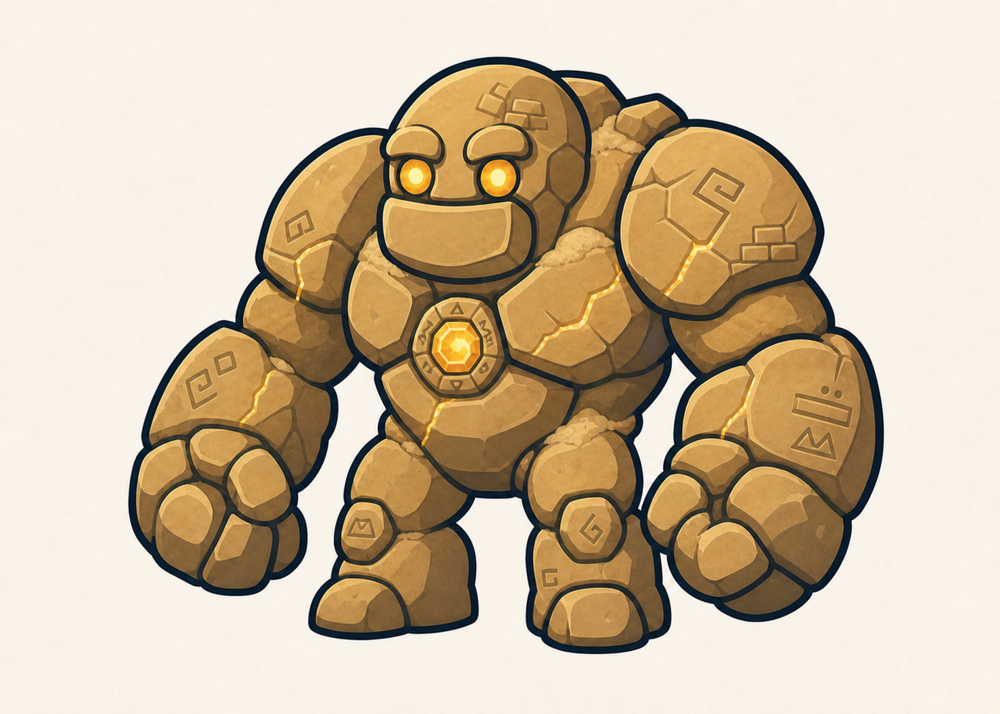

# Golem du Désert

> **Statut :** Validé

## Rôle

Le Golem du Désert est le quatrième gardien affronté par Imran. Il vérifie la maîtrise du Dash avant de permettre au joueur de débloquer une nouvelle capacité de déplacement.

## Apparence

Le golem conserve la silhouette commune aux six gardiens : un corps court et massif, de très grands poings arrondis, des jambes courtes et deux grands yeux ronds.

Son apparence désertique repose sur :

- de grands blocs de grès ocre aux formes arrondies ;
- du sable accumulé entre certaines parties de son corps ;
- des fragments d'anciennes ruines intégrés à ses plaques de pierre ;
- des symboles géométriques originaux gravés dans le grès ;
- des fissures parcourues par une énergie dorée ;
- deux yeux ronds émettant une lumière couleur ambre ;
- un cœur magique doré placé au centre de son torse.

Le Golem du Désert mesure environ deux fois et demie la taille d'Imran. Son apparence reste imposante, lisible et adaptée aux enfants à partir de 7 ans.

## Personnalité

Le golem est un gardien silencieux contrôlé par Tata Lisa. Son attitude est patiente, solennelle et immuable, comme celle d'un protecteur oublié depuis plusieurs siècles.

## Apparition

Avant le combat, le Golem du Désert est intégré à la façade d'une ancienne ruine située devant le coffre. Le sable qui le recouvre dissimule sa véritable silhouette.

Lorsque Imran approche, le vent retire progressivement le sable de son corps. Ses symboles gravés, ses yeux et son cœur magique s'illuminent d'une lumière dorée, puis il se détache lentement du monument pour bloquer le passage.

Cette apparition reprend la direction commune aux golems : le gardien est d'abord confondu avec son environnement avant de s'éveiller.

## Intention du combat

Le combat doit vérifier que le joueur maîtrise :

- l'observation des actions du boss ;
- le saut ;
- la Shadow Sword et le Smash Tranchant ;
- le Bouclier de lumière ;
- le Dash ;
- le positionnement et les contre-attaques.

Le Double saut n'est pas encore disponible et ne doit pas être nécessaire.

## Récompense

Après sa victoire, Imran peut ouvrir le coffre et récupérer la quatrième clé. Il débloque également le Double saut.

Ses trois cœurs et ses trois vies sont ensuite restaurés avant le niveau suivant.

## Défaite

Lorsque le golem est vaincu, la lumière de son cœur, de ses yeux et de ses gravures disparaît progressivement. Son corps se désassemble doucement en blocs de grès et en sable, sans représentation violente.

Le coffre qu'il protégeait devient alors accessible.

## Référence visuelle

## À détailler dans le GDD

- Phases du combat.
- Attaques.
- Fenêtres de vulnérabilité.
- Mise en scène précise.
