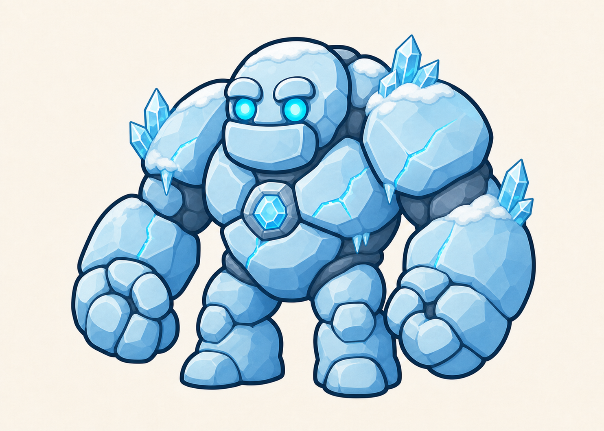

# Golem du Lac gelé

> **Statut :** Validé

## Rôle

Le Golem du Lac gelé est le troisième gardien affronté par Imran. Il constitue le premier boss conçu pour vérifier la maîtrise du Dash obtenu après le Golem de la Grotte.

## Apparence

Le golem conserve la silhouette commune aux six gardiens : un corps court et massif, de très grands poings arrondis, des jambes courtes et deux grands yeux ronds.

Son apparence glacée repose sur :

- de grands blocs de glace bleu pâle aux formes arrondies ;
- quelques plaques de pierre gelée visibles sous la glace ;
- des cristaux de glace sur les épaules, les avant-bras et le dos ;
- une fine couche de neige sur la tête et les épaules ;
- quelques petits glaçons qui ne surchargent pas sa silhouette ;
- des fissures parcourues par une énergie bleu clair ;
- deux yeux ronds émettant une lumière bleu glacier ;
- un cœur magique en forme de cristal de glace placé au centre de son torse.

Le Golem du Lac gelé mesure environ deux fois et demie la taille d'Imran. Son apparence reste imposante, lisible et adaptée aux enfants à partir de 7 ans.

## Personnalité

Le golem est un gardien silencieux contrôlé par Tata Lisa. Son attitude est froide, calme et imperturbable.

Il donne l'impression d'être resté endormi sous la glace pendant de nombreuses années.

## Apparition

Avant le combat, le Golem du Lac gelé est prisonnier d'une grande paroi de glace située devant le coffre. Sa silhouette ressemble à une formation naturelle gelée.

Lorsque Imran approche, une lumière bleue apparaît dans son cœur et des fissures lumineuses se propagent dans la glace. Ses yeux s'allument, la neige tombe de ses épaules, puis il se libère lentement de la paroi pour bloquer le passage.

Cette apparition reprend la direction commune aux golems : le gardien est d'abord confondu avec son environnement avant de s'éveiller.

## Intention du combat

Le combat doit vérifier que le joueur maîtrise :

- l'observation des actions du boss ;
- le saut ;
- la Shadow Sword et le Smash Tranchant ;
- le Bouclier de lumière ;
- le Dash ;
- le positionnement sur une surface glacée.

Le Double saut n'est pas encore disponible et ne doit pas être nécessaire.

## Récompense

Après sa victoire, Imran peut ouvrir le coffre et récupérer la troisième clé. Aucun nouveau pouvoir n'est débloqué.

Ses trois cœurs et ses trois vies sont ensuite restaurés avant le niveau suivant.

## Défaite

Lorsque le golem est vaincu, la lumière de son cœur et de ses fissures disparaît progressivement. Son corps se désassemble doucement en blocs de glace et en cristaux, sans représentation violente.

Le coffre qu'il protégeait devient alors accessible.

## Référence visuelle

## À détailler dans le GDD

- Phases du combat.
- Attaques.
- Fenêtres de vulnérabilité.
- Mise en scène précise.
