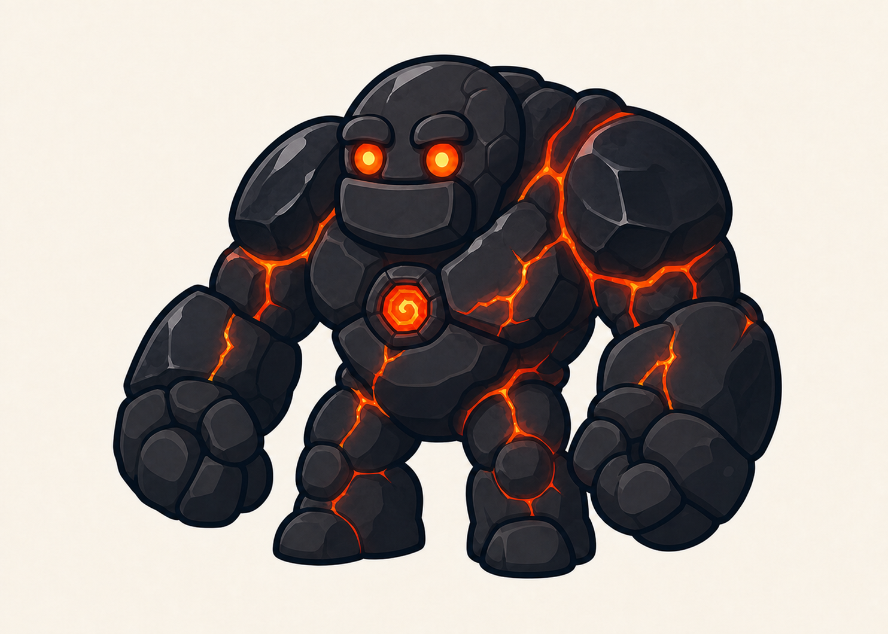

# Golem du Volcan

> **Statut :** Validé

## Rôle

Le Golem du Volcan est le cinquième gardien affronté par Imran. Il constitue la première épreuve demandant une maîtrise combinée du Dash et du Double saut.

## Apparence

Le golem conserve la silhouette commune aux six gardiens : un corps court et massif, de très grands poings arrondis, des jambes courtes et deux grands yeux ronds.

Son apparence volcanique repose sur :

- de grands blocs de basalte noir aux formes arrondies ;
- quelques plaques d'obsidienne brillantes ;
- des fissures remplies de magma incandescent ;
- deux yeux ronds émettant une lumière rouge-orangée ;
- un cœur magique incandescent entouré de roche refroidie au centre de son torse ;
- une légère chaleur visible autour de certaines parties de son corps, sans flammes excessives.

Le Golem du Volcan mesure environ deux fois et demie la taille d'Imran. Malgré son énergie plus menaçante, sa silhouette reste lisible et adaptée aux enfants à partir de 7 ans.

## Personnalité

Le golem est un gardien silencieux contrôlé par Tata Lisa. Il paraît plus puissant et instable que les gardiens précédents, mais ses intentions restent clairement compréhensibles par le joueur.

## Apparition

Avant le combat, le Golem du Volcan est confondu avec une ancienne coulée de lave refroidie contre une paroi située devant le coffre.

Lorsque Imran approche, son cœur commence à briller comme une braise. Les fissures de son corps s'illuminent progressivement, des fragments de roche refroidie se détachent, puis il se libère lentement de la paroi pour barrer le passage.

Cette apparition reprend la direction commune aux golems : le gardien est d'abord confondu avec son environnement avant de s'éveiller.

## Intention du combat

Le combat doit vérifier que le joueur maîtrise :

- l'observation des actions du boss ;
- la Shadow Sword et le Smash Tranchant ;
- le Bouclier de lumière ;
- le Dash ;
- le Double saut ;
- l'enchaînement des déplacements et des contre-attaques.

La difficulté doit être supérieure à celle des gardiens précédents tout en conservant des actions clairement annoncées.

## Récompense

Après sa victoire, Imran peut ouvrir le coffre et récupérer la cinquième clé. Aucun nouveau pouvoir n'est débloqué.

Ses trois cœurs et ses trois vies sont ensuite restaurés avant le niveau suivant.

## Défaite

Lorsque le golem est vaincu, son cœur magique s'éteint et la lumière du magma disparaît progressivement. Ses fissures refroidissent, puis son corps se désassemble doucement en blocs de basalte et d'obsidienne, sans représentation violente.

Le coffre qu'il protégeait devient alors accessible.

## Référence visuelle

## À détailler dans le GDD

- Phases du combat.
- Attaques.
- Fenêtres de vulnérabilité.
- Mise en scène précise.
