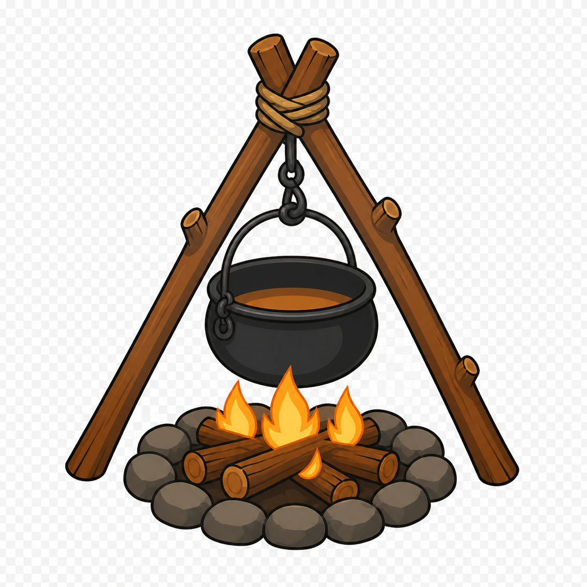

# Feux de camp

> **Statut :** Valide

## Origine

Les feux de camp ont ete installes par Remi et Amelie pendant leurs anciennes expeditions a travers les six regions.

Ils montrent que les parents d'Imran ont deja parcouru et securise ces routes avant leur nouveau voyage au debut de l'histoire.

## Fonction

- Un feu de camp permet a Imran de retrouver ses trois coeurs avant une etape importante.
- Le soin est volontaire : Imran doit utiliser la commande `Interaction` pres du feu.
- Entrer dans la zone du feu ne restaure rien automatiquement.
- Il ne restaure aucune vie : le nombre de vies restantes ne change pas.
- Aucun coeur ne peut etre recupere pendant l'exploration ordinaire.
- Le feu de camp ne sert ni de checkpoint, ni de sauvegarde automatique.
- Son fonctionnement exact est defini dans le GDD.

## Reference visuelle validee

Le visuel conserve uniquement les elements utiles : un trepied en bois, une chaine, une marmite, des flammes, des buches et un cercle de pierres. Aucun bol, couvert, pain ou reste de repas ne doit apparaitre devant le feu.

La marmite suggere le repas prepare par Remi et Amelie et permet de comprendre la fonction de soin sans ajouter d'objet au premier plan.

## Preparation pour Godot

Lors de la production des ressources definitives, le visuel doit etre decoupe en elements independants :

- trepied, buches et pierres immobiles ;
- marmite, anse, chaine et crochet separes pour permettre un leger balancement ;
- flammes separees pour une boucle image par image ;
- petites braises optionnelles sur un calque distinct ;
- fond transparent et contours propres pour faciliter l'integration dans Godot.

## Placement

- Un feu de camp est place a la fin du niveau 0, avant le passage vers la Foret enchantee.
- Un feu de camp est place dans une zone sure juste avant chaque arene de golem.
- Aucun ennemi ni danger ne peut atteindre Imran pendant l'utilisation du feu.

## Role narratif

Les feux prolongent la presence bienveillante de Remi et Amelie pendant l'aventure. Comme les pancartes de controle, ils ont ete laisses pour proteger les voyageurs et aider Imran sans que ses parents soient physiquement presents.

## Criteres de validation

Les feux de camp sont coherents si :

- leur origine familiale reste comprise ;
- leur placement precede clairement le niveau 1 ou un combat de golem ;
- leur soin demande toujours une interaction volontaire ;
- ils restaurent les coeurs sans remplacer un checkpoint ;
- ils ne modifient jamais le nombre de vies restantes ;
- leur apparence correspond a la reference visuelle validee ;
- leur zone reste sure et lisible.

## Sources

- [Remi](../04-Personnages/Remi.md)
- [Amelie](../04-Personnages/Amelie.md)
- [Points de controle](Points-de-Controle.md)
- [Tutoriel du niveau 0](Tutoriel-Niveau-0.md)
