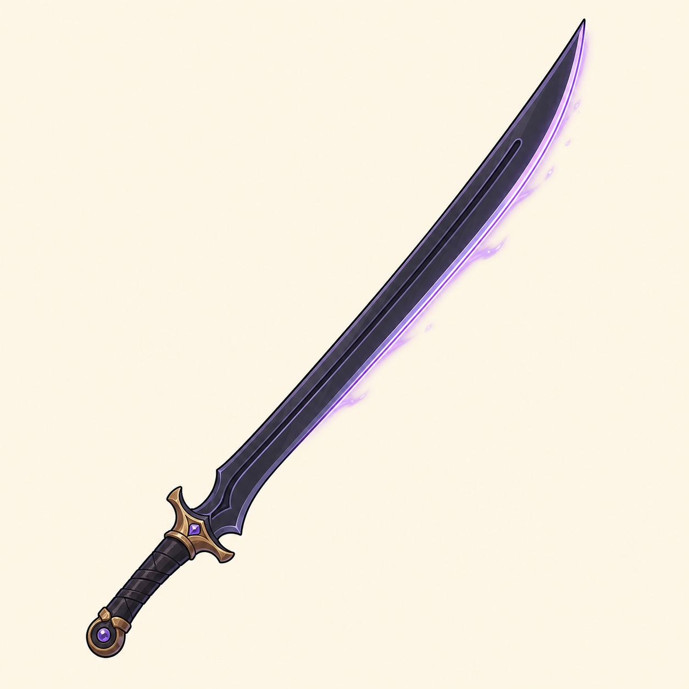

# Shadow Sword

> **Statut :** Valide

La Shadow Sword est une epee magique offerte a Imran par Remi. Elle sert aux attaques normales et permet de charger le Smash Tranchant.

## Apparence

La Shadow Sword possede une silhouette longue, fine et legerement courbee.

Son apparence repose sur :

- une lame presque noire, composee de nuances anthracite ;
- une base plus large qui se resserre progressivement vers une pointe fine ;
- une longue rainure centrale qui accompagne la courbure ;
- un tranchant souligne par une lumiere violet lavande ;
- une garde compacte en bronze dore ;
- une poignee sombre entouree de bandes croisees ;
- un pommeau rond et solide ;
- de petits cristaux violets integres a la garde et au pommeau.

Les cristaux et le reflet violet appartiennent a l'energie propre de la Shadow Sword. Leur lumiere reste fine, stable et froide afin de ne pas etre confondue avec les flammes instables de la magie du Chaos.

## Role visuel

- La silhouette doit rester reconnaissable dans toutes les poses d'Imran.
- Le tranchant lumineux rend la lame visible dans le Chateau et les autres zones sombres.
- La trainee d'une attaque suit exactement le mouvement de la lame.
- Le Smash Tranchant reprend le noir brillant et le contour violet de l'epee.
- La lumiere ne doit pas masquer les mains, le visage ou la posture d'Imran.
- Les proportions exactes et la portee des attaques seront definies dans le GDD.

## Reference visuelle

