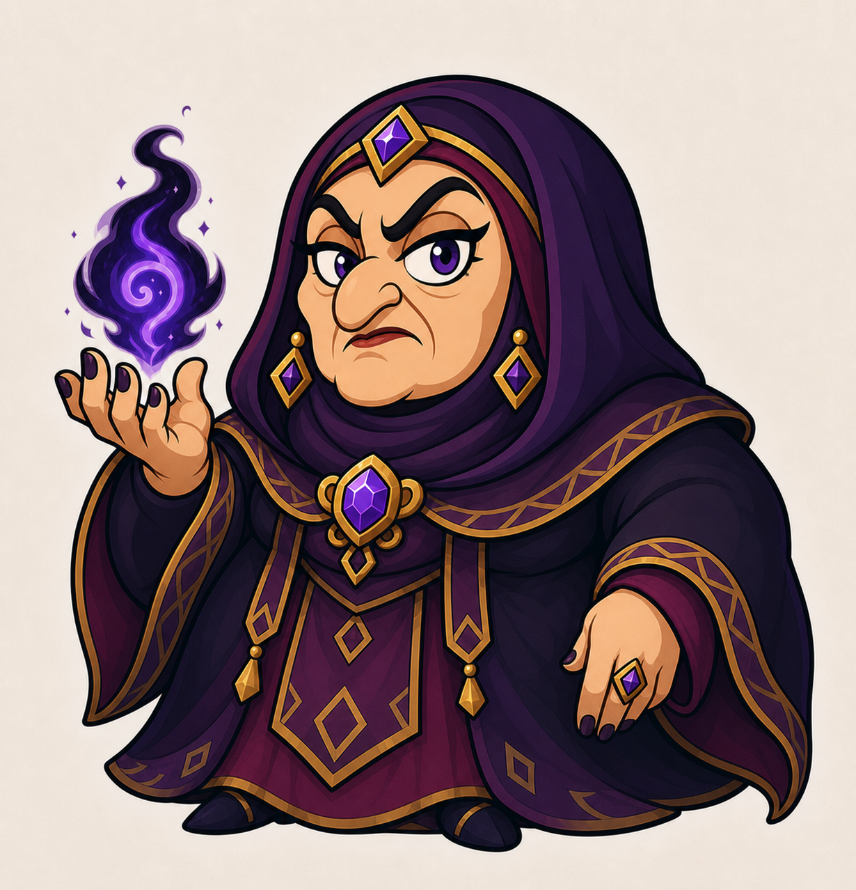

# Tata Lisa — boss final

> **Statut :** Validé

## Rôle

Tata Lisa est le boss final d'**Imran Adventure**. Elle intervient après la défaite du Golem du Château et la récupération de la sixième clé.

Elle affronte Imran devant la porte du donjon afin de l'empêcher de libérer Aliyah.

## Identité visuelle

Tata Lisa possède une tête très grande et disproportionnée, un corps court et corpulent, un visage expressif aux formes cartoon et un voile de style hijab couvrant ses cheveux et son cou.

Sa tenue bordeaux, violette, noire et doree l'associe visuellement a la magie du Chateau. Sa magie du Chaos est representee par une energie violette en forme de flamme.

Le grand bijou violet qu'elle porte autour de son cou est la **Pierre du Chaos**, source de l'ensemble de ses pouvoirs magiques.

## Intention du combat

Le combat final doit demander au joueur d'utiliser l'ensemble des capacités acquises pendant l'aventure :

- la Shadow Sword et le Smash Tranchant ;
- le Bouclier de lumière ;
- le Dash ;
- le Double saut ;
- l'observation, la défense et les contre-attaques.

Tata Lisa doit se distinguer des golems par son utilisation directe de la magie et par une présence plus expressive et théâtrale.

Son comportement pendant l'affrontement doit refléter sa personnalité jalouse, grincheuse et tyrannique. Elle considère Imran comme un enfant incapable de lui résister et s'irrite progressivement lorsqu'il parvient à déjouer ses pouvoirs.

## Conclusion du combat

Lorsque Tata Lisa est vaincue, la Pierre du Chaos se brise. Elle perd ses pouvoirs et prend la fuite. Sa magie disparait avec la pierre et la protection magique qui recouvre les six verrous est levee. Les verrous physiques restent fermes jusqu'a ce qu'Imran utilise les six cles pour ouvrir la porte et liberer Aliyah.

## Référence visuelle

## À détailler dans le GDD

- Phases du combat.
- Attaques magiques.
- Fenêtres de vulnérabilité.
- Mise en scène précise.
