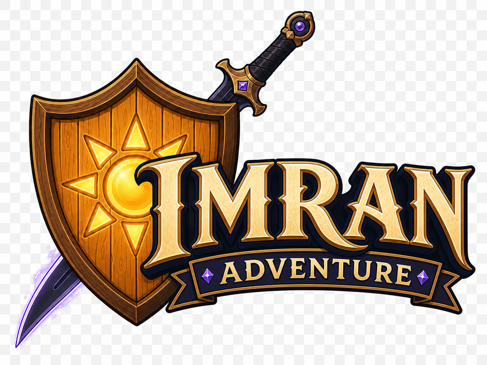

# Logo

> **Statut :** Valide

## Intention

Le logo de **Imran Adventure** represente une aventure fantasy accessible, le courage d'un jeune heros et l'equilibre entre la lumiere protectrice et l'energie sombre de la Shadow Sword.

## Composition validee

La composition utilise trois niveaux :

1. Le Bouclier de lumiere est place a gauche et en arriere-plan.
2. La Shadow Sword traverse la composition en diagonale derriere le bouclier, avec la lame visible en bas a gauche et la poignee visible en haut a droite.
3. Le titre **Imran Adventure** apparait au premier plan.

Le symbole solaire du bouclier reste partiellement visible derriere le titre. La silhouette de l'epee et du bouclier doit rester reconnaissable lorsque le logo est affiche en petit.

## Typographie

- **Imran** constitue le mot principal.
- **Adventure** apparait en dessous sur une banniere plus petite.
- Les lettres utilisent une typographie medievale fantasy originale.
- Les empattements sont sculptes, legerement pointus et inspires de la calligraphie.
- La lecture reste prioritaire sur les ornements.
- La typographie ne doit pas reprendre celle d'une licence existante.

## Equipements representes

### Bouclier de lumiere

- bois couleur miel ;
- bordure epaisse en bois sombre ;
- symbole solaire dore a huit rayons ;
- lumiere chaude et protectrice.

### Shadow Sword

- longue lame noire legerement courbee ;
- garde en bronze dore ;
- poignee sombre ;
- cristaux violets ;
- fin tranchant magique violet lavande.

Les deux objets reprennent leurs concepts visuels valides sans modifier leur fonction ou leur origine.

## Couleurs

| Element | Couleur |
|---|---|
| Lettres principales | Ivoire chaud et or pale |
| Contour du titre | Bleu nuit et anthracite |
| Bordures | Bronze dore |
| Bouclier | Bois miel et brun sombre |
| Lumiere | Jaune dore et blanc chaud |
| Shadow Sword | Noir anthracite et violet lavande |
| Banniere | Bleu nuit avec bordure doree |

Le violet reste un accent secondaire. Il ne devient pas la couleur dominante du logo.

## Originalite

La mise en scene generale s'inspire du principe classique d'une epee et d'un bouclier places derriere un titre d'aventure. Le logo conserve une identite propre grace :

- au Bouclier de lumiere en bois et a son soleil ;
- a la silhouette courbee de la Shadow Sword ;
- a la palette ivoire, bois, bleu nuit et violet ;
- a une typographie medievale originale ;
- a une banniere distincte pour le mot `Adventure`.

Aucun symbole, texte, embleme ou dessin protege d'une autre licence ne doit etre reproduit.

## Versions a produire

- version principale avec epee, bouclier et titre ;
- version sur fond transparent ;
- version compacte pour une vignette carree ;
- version monochrome claire ;
- version monochrome sombre ;
- symbole seul pour l'icone du jeu ;
- version simplifiee lisible en petite taille.

L'image validee dans ce document constitue la reference de concept. Son fond en damier devra etre remplace par une vraie transparence lors de la production de la version finale.

## Utilisation

- Conserver une zone vide autour du logo.
- Eviter un fond charge derriere les lettres.
- Ajouter un contour externe si le logo est pose sur une illustration complexe.
- Tester le logo sur les palettes claire du Village et sombre du Chateau.
- Ne pas deformer, recadrer ou separer les elements de la version principale.

## Reference visuelle

